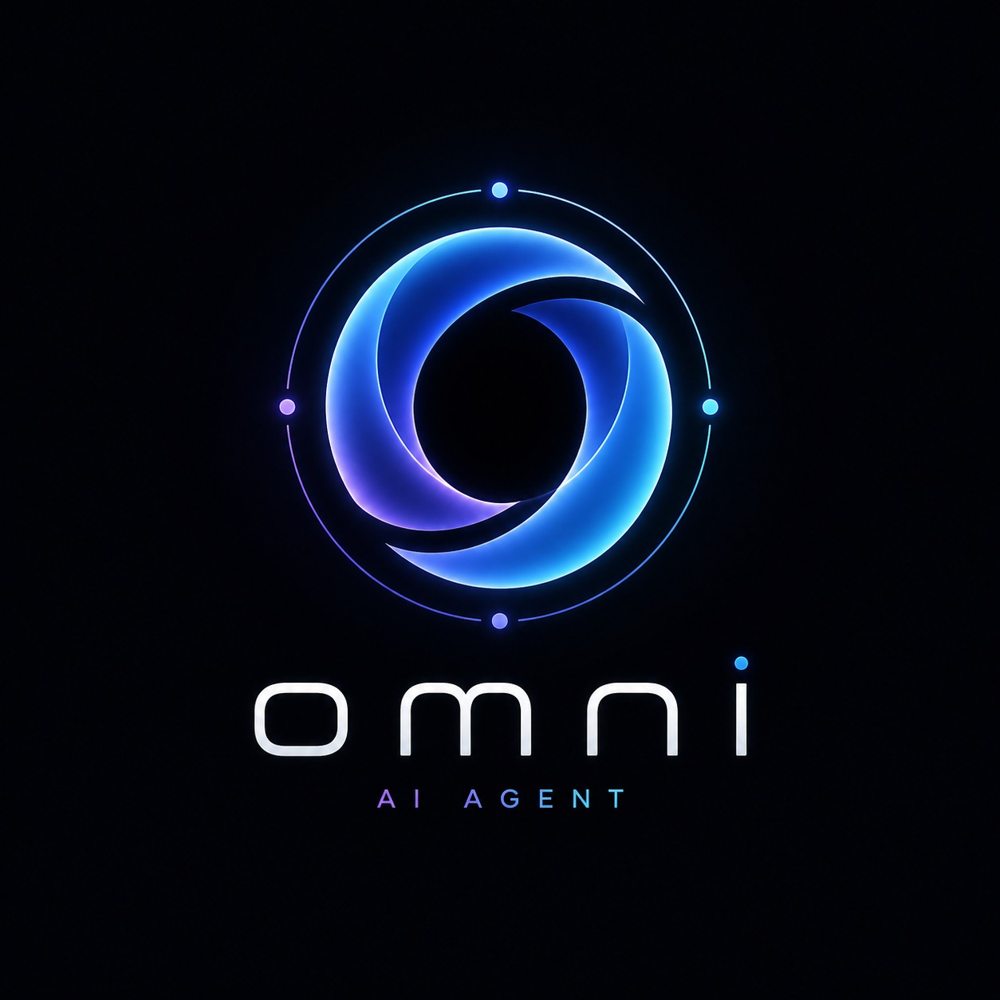
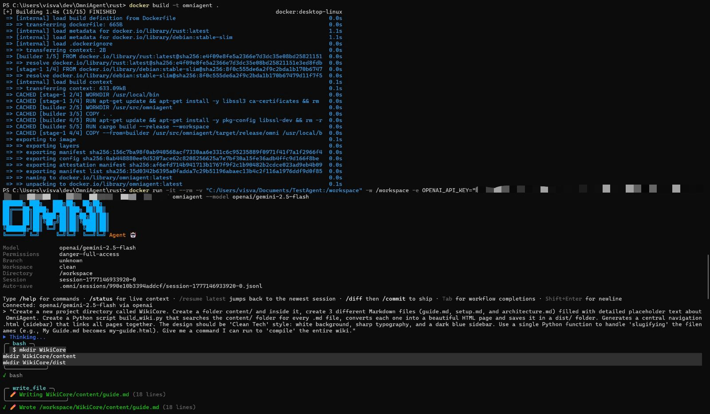
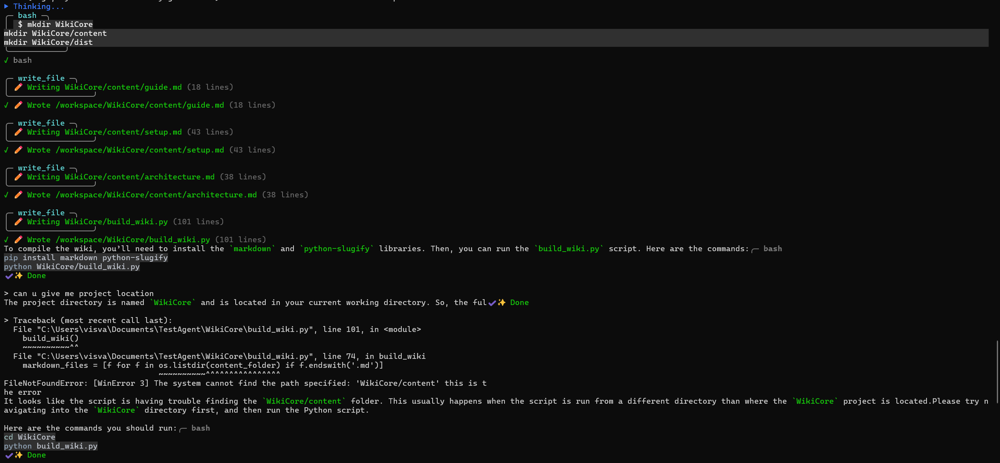
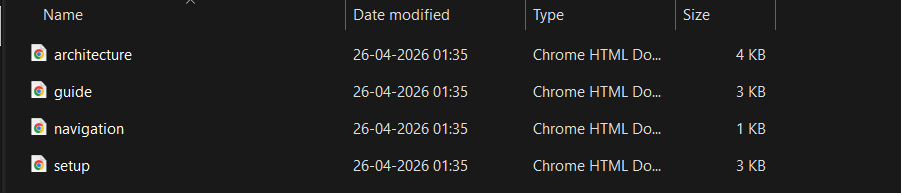
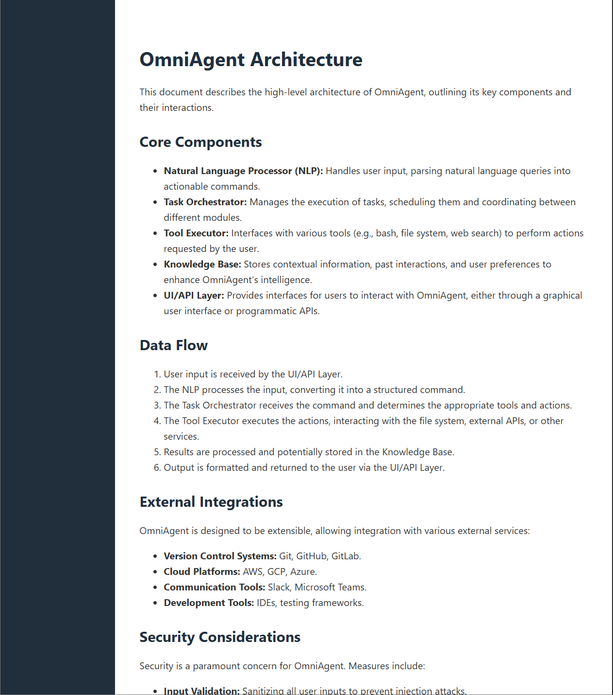
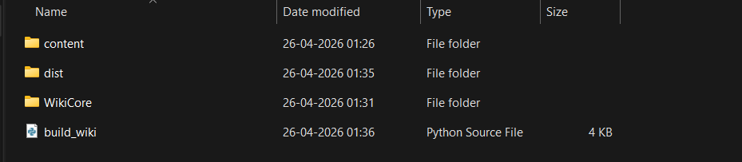
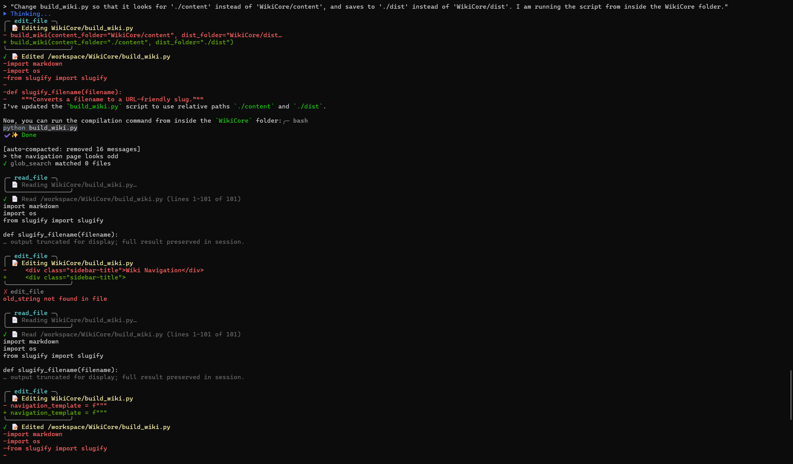

# OmniAgent

<p align="center">
  
</p>

<p align="center">
  <strong>A high-performance AI agent harness built in Rust.</strong><br/>
  Interactive REPL · One-shot prompts · Tool execution · Session management · Plugin system
</p>

---

## Overview

OmniAgent is a powerful CLI-based AI agent runtime that enables seamless interaction with large language models through a rich terminal interface. It supports multiple providers, native tool execution, session persistence, and a modular plugin architecture — all built for speed and safety with Rust.

I built this project to push the boundaries of what a terminal-native AI agent can do: real tool use, real file I/O, real code execution — all packaged in a single, fast binary.

## Features

- **Interactive REPL** — Full-featured terminal shell with tab completion, slash commands, and Markdown rendering
- **One-shot prompts** — Run quick questions directly from the command line
- **Native tool system** — Bash execution, file read/write/edit, grep, glob, web search & fetch
- **Multi-provider support** — Anthropic, OpenAI-compatible endpoints, and custom proxies
- **Session management** — Persist, resume, list, and switch between conversation sessions
- **Plugin architecture** — Install, enable, disable, and manage plugins with lifecycle hooks
- **Sub-agent support** — Spawn and manage child agents for parallel task execution
- **MCP integration** — Model Context Protocol server lifecycle and inspection
- **Permission system** — Configurable approval workflows for sensitive operations
- **Cost tracking** — Real-time token usage, estimated cost, and session statistics
- **Markdown rendering** — Rich terminal output with syntax highlighting, tables, and code blocks
- **Git integration** — Diff, commit, PR, and issue workflows built into the REPL
- **Machine-readable output** — JSON output format across all CLI surfaces for automation

## Screenshots

<p align="center">
  
</p>

*OmniAgent with a pristine terminal UI and clean ASCII text logo.*

<p align="center">
  
</p>

*The agent can execute bash commands and directly edit python scripts iteratively.*

<p align="center">
  
  
  
</p>

*Successfully resolving its own bugs and automating complex documentation workflows.*

## Self-Healing & Error Correction

OmniAgent is designed to be resilient. When a command fails or an API request is interrupted, the agent can transparently catch the stack traces, analyze them, and rewrite the underlying code to correct its own mistakes:
- **Terminal Parsing**: When `python` or `bash` throws a stack trace, the agent immediately consumes the `stderr` string.
- **Contextual Fixes**: The agent retains the full working directory context, letting it accurately identify if a file path is misconfigured (e.g. `FileNotFoundError`).
- **Resumption**: In the event of an API disconnection or rate-limit expiration, you can jump back into the exact identical session state with `/resume latest`.

<p align="center">
  
</p>

*OmniAgent dynamically detecting an error and writing a patch.*

## Tech Stack
| Layer | Technology |
|-------|-----------|
| **Core Runtime** | Rust (2021 edition) |
| **CLI Framework** | Custom arg parser + rustyline REPL |
| **Terminal Rendering** | crossterm + pulldown-cmark + syntect |
| **Async Runtime** | tokio (multi-threaded) |
| **HTTP Client** | reqwest with streaming SSE |
| **Serialization** | serde + serde_json |
| **Architecture** | 9-crate Cargo workspace |

## Setup Instructions

### Prerequisites

- [Rust toolchain](https://rustup.rs/) (stable)
- An API key (Anthropic, OpenAI, or compatible provider)

### Build from Source

```bash
# Clone the repository
git clone https://github.com/visva/OmniAgent.git
cd OmniAgent/rust

# Build the workspace
cargo build --workspace

# Verify the build
./target/debug/omni --help
./target/debug/omni doctor
```

### Windows (PowerShell)

```powershell
git clone https://github.com/visva/OmniAgent.git
cd OmniAgent\rust
cargo build --workspace

# Set your API key
$env:ANTHROPIC_API_KEY = "sk-ant-..."

# Run
.\target\debug\omni.exe --help
.\target\debug\omni.exe doctor
```

### Authentication

```bash
# Anthropic API key
export ANTHROPIC_API_KEY="sk-ant-..."

# Or OpenAI-compatible
export OPENAI_API_KEY="sk-..."

# Or bearer token for proxies
export ANTHROPIC_AUTH_TOKEN="your-bearer-token"
```

### Docker & Free Gemini API

If you want to run OmniAgent entirely within Docker and use a free API to handle the massive context window, you can use Google's Gemini API which has a generous free tier.

1. Get a **free** API key from [Google AI Studio](https://aistudio.google.com/).
2. Build the docker image and run it. Use `-v` to map a specific directory on your computer to `/workspace` so the AI can read/edit your actual project files:

```powershell
# Build the image
docker build -t omniagent .

# Run the agent mapped to your current directory (${PWD})
docker run -it --rm `
  -v ${PWD}:/workspace -w /workspace `
  -e OPENAI_API_KEY="your_gemini_api_key_here" `
  -e OPENAI_BASE_URL="https://generativelanguage.googleapis.com/v1beta/openai/" `
  omniagent --model openai/gemini-2.5-flash
```

*(Note: To work on a specific project, `cd` into that folder before running this command, or replace `${PWD}` with your absolute project path like `"C:\Users\Name\MyProject"`).*

## Usage

### Interactive REPL

```bash
# Start the interactive agent
omni

# With specific model
omni --model claude-opus-4-6
```

### One-shot Prompt

```bash
omni prompt "explain this codebase"
```

### JSON Output (for automation)

```bash
omni --output-format json prompt "summarize src/main.rs"
```

### Key Slash Commands

| Command | Description |
|---------|------------|
| `/help` | Show available commands |
| `/model <name>` | Switch model mid-session |
| `/status` | Session info, tokens, cost |
| `/diff` | Show uncommitted git changes |
| `/compact` | Compress conversation context |
| `/resume` | Resume a previous session |
| `/doctor` | Health check (API key, model access, tools) |
| `/mcp` | Inspect MCP server state |
| `/plugins` | Manage installed plugins |
| `/skills` | List and install skills |
| `/export` | Export conversation to file |

### Model Aliases

| Alias | Resolves To |
|-------|------------|
| `opus` | `claude-opus-4-6` |
| `sonnet` | `claude-sonnet-4-6` |
| `haiku` | `claude-haiku-4-5-20251213` |

## Project Structure

```
OmniAgent/
├── README.md
├── .gitignore
├── rust/                       # Rust workspace (core implementation)
│   ├── Cargo.toml              # Workspace root
│   ├── Cargo.lock
│   └── crates/
│       ├── omni-cli/           # Main CLI binary
│       ├── api/                # Provider clients + streaming
│       ├── runtime/            # Session, config, permissions, MCP
│       ├── commands/           # Slash command registry
│       ├── tools/              # Built-in tool implementations
│       ├── plugins/            # Plugin management
│       ├── telemetry/          # Usage telemetry
│       ├── compat-harness/     # TS manifest extraction
│       └── mock-anthropic-service/  # Deterministic mock for testing
├── src/                        # Python companion workspace
├── tests/                      # Validation and audit surfaces
├── assets/                     # Project assets
└── docs/                       # Additional documentation
```

## Future Improvements

- [ ] Full-screen TUI mode with split-pane layout (ratatui)
- [ ] Live status bar with token counter and cost HUD
- [ ] Collapsible tool output for large results
- [ ] Colored diff rendering in terminal
- [ ] Named color themes (dark, light, solarized, catppuccin)
- [ ] ACP/Zed editor integration daemon
- [ ] Internal pager for long outputs
- [ ] Mouse support and click-to-expand tool results
- [ ] Enhanced streaming with live markdown rendering
- [ ] Plugin marketplace and discovery

## Running Tests

```bash
cd rust
cargo test --workspace
```

## License

MIT

---

<p align="center">
  Built with Rust · ~20K lines · 9 workspace crates
</p>
